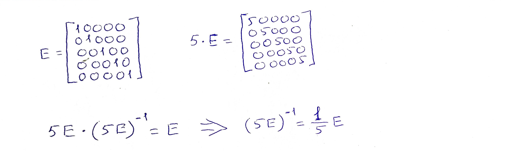
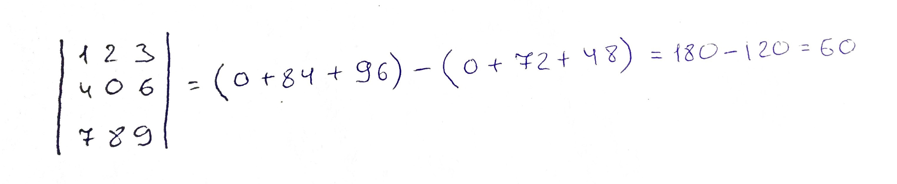
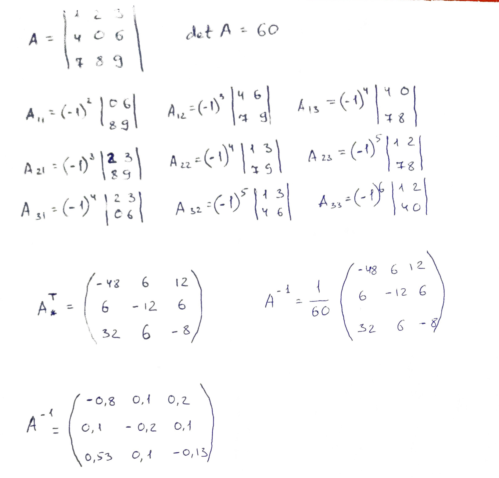
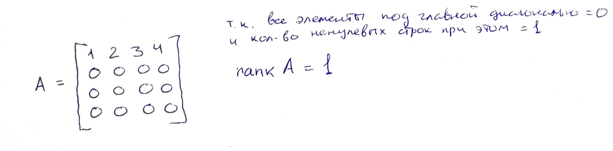
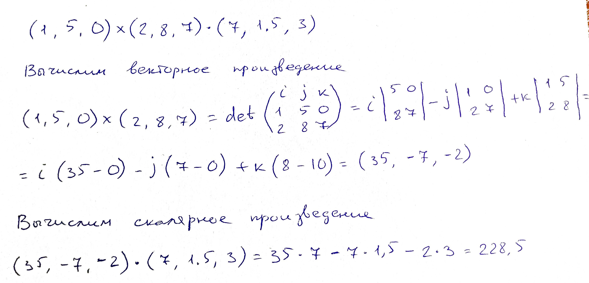

# Домашнее задание 7.1
**Задача 1** - Вектор – это частный случай матрицы 1хN и Nх1.  
Повторите материал для векторов, уделяя особое внимание умножению A∙B.  
Вычислите, по возможности не используя программирование: (5Е)–1, где Е – единичная матрица размера 5х5.

**Задача 2** - Вычислите определитель:

**Задача 3.1** - Вычислите матрицу, обратную данной:

**Задача 3.2** - Приведите пример матрицы 4х4, ранг которой равен 1.

**Задача 4** - Вычислите скалярное произведение двух векторов:  
(1, 5)  и  (2, 8)

**Задача 5** - Вычислите смешанное произведение трех векторов:
(1, 5, 0), (2, 8, 7) и (7, 1.5, 3)

